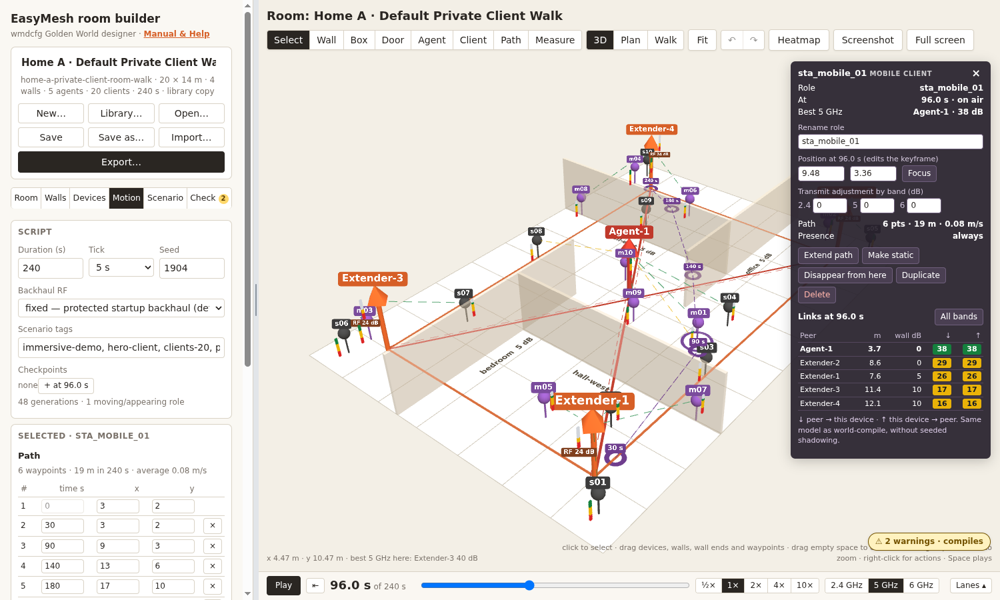

# EasyMesh room builder

A visual designer for the virtual rooms of the
[EasyMesh evaluation lab](https://boardfarmdevs.github.io/meta-cmf-bananapi-vcpe/):
floor plans of any size, walls of any material, the mesh agents, their
clients, and movement scenarios — written in the configurator's own
Golden World language (`wmdcfg.world-layout.v1` + `wmdcfg.mobility.v1`) and
compiled to exactly the same `wmdcfg.world-plan.v1` as `wmdcfg world-compile`.

It runs on its own: Python 3.9+ standard library only (like the reference
configurator), with a browser UI served locally. Three.js r128 — the build the
reference room viewer uses — is bundled, so nothing is fetched from the
internet.

```sh
./room-builder serve            # http://127.0.0.1:8790/
```



## What it does

- **Rooms** of any size; stretch, shrink or scale them with their contents.
- **Walls** drawn by click, box or typed length, snapped to the grid, other
  walls and 15° angles; ten materials (glass 2 dB … RF isolation 70 dB) or
  any custom loss; door gaps; double walls; editable ends, length and angle.
- **Agents and clients** with the lab's role names (gateway, extender_N,
  sta_static/mobile/pool), wired backhaul, per-band transmit adjustment,
  parking, bulk placement.
- **Optimal extender placement**: N extenders maximising modelled coverage
  over floor area and/or client positions, each keeping a ≥ 20 dB Wi-Fi
  backhaul hop toward the gateway, off wall lines, with minimum spacing.
- **Movement scenarios**: paths by clicking, keyframes by dragging at any
  time, retiming at a speed, dwells, templates, presence spans, checkpoints,
  playback that stops at checkpoints like the live room, timeline lanes.
- **Every configurator property**: propagation, shadowing and seed, SNR
  clamps, tick, backhaul RF policy, band-steering profiles and expectations,
  traffic experiments, room-guide text.
- **3D browsing** that looks like the room viewer (same scene construction,
  palette, labels, gauges, links and backhaul ribbons), plus an exact
  orthographic plan view and a first-person walk-through; a coverage heatmap;
  a measure tool; a live link inspector.
- **Designs**: save, save as, open, duplicate, delete, revision history and
  restore; browser draft recovery; 50 library rooms.
- **Import** of builder designs, layout/mobility documents and compiled
  `.world.json` files (rebuilt exactly, or reconstructed with 100 % link
  agreement for every reference world).
- **Export** of a lab-ready bundle (configurator tree + `.wmd` + build line +
  guide entry + verification report), layout/mobility/world/`.wmd`, PNG/JPEG/
  WebP/4K screenshots, vector SVG (view and to-scale floor plan), DXF, glTF/
  GLB/OBJ/STL and WebM video.
- **Checking**: live findings with tips, and a verification suite that runs
  the room through the configurator's functions, the live room's admission
  rules and RF sanity checks — optionally with byte parity against a
  reference checkout.

## Parity with the reference configurator

`roombuilder/geometry.py`, `world.py`, `wmd.py`, `traffic.py` and `bands.py`
are ports of `gen/wmediumd/configurator/wmdcfg` and the room demo's band
profile rules, in step with upstream commit `a796f3a` (wired extenders as
backhaul parents, `ap_expectations`). The library's 31 reference rooms carry their layout and
mobility verbatim and the tests prove they reproduce the reference
`golden_sha256`. With a checkout available:

```sh
ROOMBUILDER_REFERENCE=/path/to/meta-cmf-bananapi-vcpe python3 -m unittest tests.test_reference_parity
./room-builder library --check --reference /path/to/meta-cmf-bananapi-vcpe
```

compiles and exports every library room with both implementations and
compares the bytes, and reproduces every golden of the reference's four room
trees (standard, wired, pods, pods + wired). The browser's RF model (`static/js/rfmodel.js`) is
checked against the compiler under node (`tests/test_js_model.py`),
including Python's round-half-to-even.

## Serving on the network

By default the server only listens on this machine. To reach it from other
machines at `http://<this machine's IP>/` (port 80 needs root to bind; `--user`
drops to your account right after binding, so the app and its files never
run or get written as root):

```sh
sudo setsid nohup ./room-builder serve --host 0.0.0.0 --port 80 --user "$USER" > room-builder.log 2>&1 < /dev/null &
pkill -f 'roombuilder serve'      # stop it (it runs as your user)
```

Without sudo, use a high port instead: `./room-builder serve --host 0.0.0.0`
and open `http://<IP>:8790/`. The server has no login: anyone who can reach
the port can open, save and delete designs (deleted designs keep a copy in
`designs/.history/`). `--allow 192.168.2.0/24` (repeatable) restricts it to
given networks; this machine is always allowed.

## GitHub Pages (no server)

`room-builder build-site` writes a static site that runs everything in the
visitor's browser: the same Python package runs in
[Pyodide](https://pyodide.org) (CPython compiled to WebAssembly) in a web
worker, and the UI sends its API calls there instead of to a server
(`static/js/backend.js`, `static/js/pyworker.js`). Checks, compiling,
exports, the optimiser and import are identical; the in-browser build
reproduces all 31 reference golden hashes. Designs are saved in the
visitor's browser (IndexedDB) — use Export → Design JSON / Import to move
them. The first visit downloads about 14 MB (Pyodide is copied into the site,
pinned to a version and checked against its published integrity hash).

```sh
./room-builder build-site --out site          # then: python3 -m http.server --directory site
```

To publish:

1. Create an empty repository on github.com (Pages on a free plan needs it to
   be public).
2. Push this directory to its `main` branch.
3. In the repository: **Settings → Pages → Build and deployment → Source:
   GitHub Actions**.

`.github/workflows/pages.yml` then runs the unit tests, builds the site and
deploys it on every push to `main`, to `https://<owner>.github.io/<repo>/`.

## Command line

```sh
./room-builder serve [--host 127.0.0.1] [--port 8790] [--data designs/] [--user NAME] [--allow CIDR] [--reference PATH] [--open]
./room-builder verify ROOM [--profile rdk-lab] [--reference PATH] [--json]
./room-builder compile ROOM -o room.world.json [--pretty]
./room-builder export ROOM --format layout|mobility|world|wmd|bundle|svg|dxf|design [--band all] [-o OUT]
./room-builder place ROOM --count 4 [--band 5] [--strategy replace|add] [--objective balanced] [-o OUT]
./room-builder library [--check] [--export DIR]
./room-builder build-site [--out site] [--pyodide DIR]
```

`ROOM` is a design JSON, a layout JSON (optionally followed by a mobility
JSON), a compiled `.world.json`, or a library room id such as
`home-a-slow-walk-ten`. `verify` exits non-zero when a check fails.

## HTTP API

All JSON; `design` is a `roombuilder.design.v1` document.

| Method & path | Body → result |
| --- | --- |
| `GET /api/health`, `GET /api/meta`, `GET /api/schema` | version, materials, lab profiles, property catalog, propagation presets |
| `GET /api/library`, `GET /api/library/{id}` | library index; one room |
| `GET/POST /api/designs`, `GET/PUT/DELETE /api/designs/{id}` | store; `PUT` takes `{design, base_revision}` and answers 409 on a conflicting save |
| `POST /api/designs/{id}/duplicate`, `GET …/history`, `GET …/history/{rev}`, `POST …/restore` | copies and revisions |
| `POST /api/new` | `{title, width_m, height_m, profile}` → new design |
| `POST /api/lint` | `{design, band}` → findings and summary |
| `POST /api/compile` | `{design}` → world plan |
| `POST /api/verify` | `{design}` → verification report |
| `POST /api/place` | `{design, count, band, strategy, objective, target_snr_db, min_backhaul_snr_db, min_spacing_m}` → placements, metrics, updated design |
| `POST /api/coverage` | `{design, band, time_ms, resolution}` → best-SNR grid and metrics |
| `POST /api/import` | `{documents: [...], base?}` → `{design, notes}` |
| `POST /api/export/{kind}` | kind = design, layout, mobility, world, wmd, bundle, svg, dxf, verification → file download |

## Layout of this directory

```
room-builder               launcher (python3 -m roombuilder)
roombuilder/               the application (stdlib only)
  geometry.py world.py     ports of wmdcfg geometry and world compiler
  wmd.py traffic.py bands.py  .wmd language, traffic and band-profile rules
  design.py                design document, import (incl. world reconstruction), bundle export
  lab.py lint.py verify.py lab profiles, findings, verification suite
  placement.py             coverage model and extender optimiser
  render.py                SVG floor plan and DXF
  store.py library.py      design store with history; example library
  webapi.py                the JSON API (transport-free: used by the server and by the browser build)
  server.py cli.py         HTTP server and command line
  site.py                  static site build for GitHub Pages (Pyodide)
  schema.py materials.py   property catalog (UI tips) and wall materials
  library/                 50 example rooms (31 reference, 19 authored)
  static/                  web UI (index.html, manual.html, css, js, vendor/three r128);
                           js/backend.js + js/pyworker.js route API calls to Pyodide on the static site
tests/                     unittest suite (python3 -m unittest discover -s tests)
tools/build_library.py     regenerates the library (--reference PATH refreshes reference rooms)
tools/ui_smoke.js          optional browser smoke test (playwright-core + Chromium)
designs/                   saved designs (created at runtime)
.github/workflows/pages.yml  tests, builds and deploys the static site
```

## Tests

```sh
python3 -m unittest discover -s tests -v
```

covers the ported configurator (including the reference project's own world
tests), golden parity of every library room, the verification suite on all
50 rooms, world-plan reconstruction, bundles and vector exports, linting and
lab profiles, the placement optimiser, the store and every HTTP endpoint, and
JS/Python model agreement. `tests/test_reference_parity.py` runs when
`ROOMBUILDER_REFERENCE` points at a reference checkout.

The browser smoke test drives the real UI (select, heatmap, plan view, wall
drawing, keyframes, optimiser, verification, export) and needs
`npm install playwright-core` plus a Chromium; see the header of
`tools/ui_smoke.js`. `SITE_URL=http://host:port/` runs it against a served
static site build instead of the Python server.

## Notes

- Library rooms in the `reference` category are copied from the reference
  project's `worlds/layouts` and `worlds/mobility` with their room-guide text,
  so the builder can prove parity and serve them as starting points.
- Designs are plain files; nothing is sent anywhere. The server listens on
  127.0.0.1 unless `--host` says otherwise and has no authentication.
